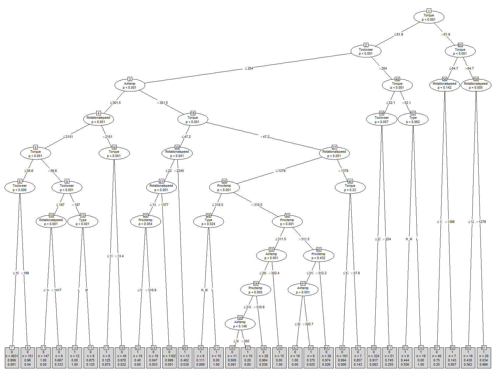
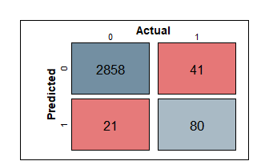
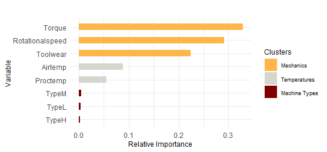
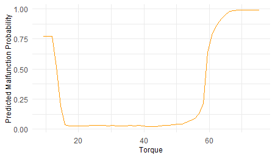
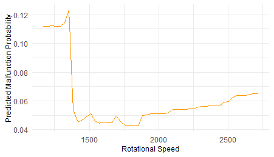
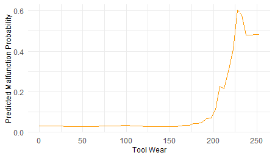

## Predictive Maintenance: Conditional Inference Tree and XGBoost

# 1 Introduction

For many manufacturing and production businesses, maintenance costs
cover a great part of their operting expenditures. Depending on the
industry, maintenance costs can represent 15 to 60 percent of the total
cost of goods sold. Previous surveys indicated that approximately one
third of all maintenance costs were wasted as a consequence of
inefficient and unnecessary maintenance ([Mobley
2002](#ref-mobley2002introduction)). As equipment neccesary for
production begins to fail, signs of malfunction might be identified by
visual checks, sounds, or even smells from the equipment. However, in
mass production environments, this procedure could be unfeasible and
inefficient. Nowadays, with the development of the Internet of Things
(IoT), predictive maintenance can be carried out by capturing data from
sensors under normal operating conditions to predict possible
malfunctions. According to [Bradbury et al.](#ref-mckinsey)
([2018](#ref-mckinsey)), predictive maintenance is able to not only
generate savings by reducing maintenance costs by approximately 18 to 25
percent, but also increase uptime by 5 to 15 percent. Also, equipment
lifespan can be extended and safety risks reduced by implementing
predictive maintenance ([Michel and Haarman 2018](#ref-pwc)). Capturing
data from the IoT devices is not the only step in the predictive
maintenance process, a model has to be build to classify possible
malfunctions using the collected data. One classic method for making
classifications is using a Decision Tree algorithm, which has been
extended by [Hothorn, Hornik, and Zeileis](#ref-hothorn2006unbiased)
([2006](#ref-hothorn2006unbiased)) to Conditional Inference Trees
(Ctree). A more recent algorithm is Extreme Gradient Boosting (XGBoost),
which has demonstrated to outperform many other algorithms in
classifications tasks ([Chen and Guestrin 2016](#ref-chen2016xgboost)).
Therefore, this research addresses the following:

*Does XGBoost outperform a Conditional Inference Tree when predicting
possible machine malfunctions for predictive maintenance?*

# 2 Data

A synthetic dataset created by [Matzka](#ref-matzka2020data)
([2020](#ref-matzka2020data)), which reflects real predictive
maintenance data encountered in the industry, is used in this paper. The
dataset consists of 10,000 observations and 6 characteristics per
machine: 1. Machine Type consists of a letter H, M, or L, which
indicates a high, medium, or low quality variant. 2. Air Temperature
indicates the air temperature in Kelvin. 3. Process Temperature
indicates the temperature in Kelvin of a certain operation. 4.
Rotational Speed is the speed of rotations in revolutions per minute
(RPM). 5. Torque is the rotational force in newtonmeter (Nm). 6. Tool
Wear indicates the minutes that the tool has been used in the process.

Machine Malfunction is labelled with 1 if the machine has failed, and 0
if the machine is still in function. In addition, the cause of machine
malfunction is also indicated by seperate columns, which are: heat
dissipation malfunction, overstrain malfunction, power malfunction, tool
wear malfunction, and random malfunction. The dataset is heavily
imbalanced, with only 339 observations labelled as machine malfunction.

# 3 Methodology

To predict whether a machine will malfunction, a Conditional Inference
Tree and an Extreme Gradient Boosting ensemble model is constructed.

Conditional Inference Trees, as introduced by [Hothorn, Hornik, and
Zeileis](#ref-hothorn2006unbiased) ([2006](#ref-hothorn2006unbiased))
are in general better than classification and regression trees because
they apply a statistical significance test at each split in the tree to
select and split variables. The algorithm is divided into two parts,
first, variable selection by testing for dependency between the response
variable and the features, second, selecting the split point for the
selected variable. This process iterates until the global null
hypothesis can not be rejected anymore at a specified level of *α*, the
global null hypothesis *H*0 is defined as:

where *j* = 1,…, *m*, *m* = 6, *Y* is the response variable machine
malfunction, *X**j* are the features,
*D*(*Y*∣*X**j*) is the distribution of *X**j*
given *Y*, which equals *D*(*Y*) under the null hypothesis. The partial
hypotheses tests each of the features separately for dependency with the
response variable. To test the hypotheses for variable selection, a
permutation test is used. After selecting the variable, the best split
point is also found following the permutation framework as described in
[Hothorn, Hornik, and Zeileis](#ref-hothorn2006unbiased)
([2006](#ref-hothorn2006unbiased)). The level of *α* can be adjusted to
control for the probability of falsely rejecting *H*0, and
also for determining the depth of a tree. A low value of *α* will result
in a more pruned tree, while a high value will result in a deeper tree.
It should be noted that a Bonferroni correction is used by the
algorithm, each hypothesis is tested at a significance level of *α*/m.

Instead of building a single tree, XGBoost builds consecutive trees
based on a previous created tree. XGBoost uses *K* additive trees to
predict the output for each instance:

where *ŷ* is the predicted probability of machine malfunction, *x* are
the feature values, *f**k* is an independent tree, *F*
indicates the space of all trees, *i* = 1,…, *n*, and *k* = 1,…, *K*.
Each of the leaves on a tree holds a continuous score *w*, using
decision rules in the trees the final prediction can be calculated by
summing up the scores in the corresponding leaves. To learn the set of
independent trees, the following regularized objective is minimized
using a gradient descent algorithm:

where the first term *l* is a loss function which measures the error
between the predicted state of the machine and the actual state of the
machine. As we are dealing with a binary classification and a highly
imbalanced dataset, the weighted cross-entropy is used as loss function:

where *s* denotes the imbalance parameter. In the case of imbalanced
data, a typical value to consider for *s* is the sum of negative
instances divided by the sum of positive instances. Intuitively, if *s*
is set to larger than 1, extra loss will be counted on classifying that
the machine is working, while in fact the machine has malfunctioned. The
second term *Ω* in equation 2 penalizes the model complexity to deal
with overfitting:

where *γ* is the minimum loss reduction needed for a node to split, and
*T* the amount of leaves in the tree. Higher values of *γ* will lead to
simpler trees and is by default set to 0. Also, L1 and L2 regularization
can be used to reduce overfitting, *λ* is by default set to 1.

After solving equations @ref(eq:eq2), @ref(eq:eq3), @ref(eq:eq4) and
@ref(eq:eq5), the optimal weight *w**j*\* for each
leaf *j* can be calculated. Using the optimal weight, the optimal value
for a tree structure can then be calculated. Subsequently, by evaluating
the optimal value, the best tree structure can be selected. As it is
impossible to enumerate all possible trees and select the best one, a
greedy algorithm is used which starts from one single leaf and adds
branches iteratively to the tree ([Chen and Guestrin
2016](#ref-chen2016xgboost)).

To evaluate the trained models, confusion matrices, which consists of
the actual and predicted classes, are created. True positive (TP)
indicates whether the positive actual class is predicted correctly, true
negative (TN) indicates whether the negative actual class is predicted
correctly, false positive (FP) indicates whether the positive actual
class is predicted incorrectly, and false negative (FN) indicates
whether the negative actual class is predicted incorrectly.

After creating the confusion matrices, accuracy measures can then be
calculated for each matrix. As our models are trained on heavily
imbalanced data, the Precision, Recall, and F1 scores are used for
evaluating the models and are determined as follows:

Precision is the proportion of the actual positive classifications among
the total predicted positive classifications, Recall is the proportion
of the actual positive classifications that are identified correctly,
and the F1-score is a metric that combines Precision and Recall. In
addition, the Area under the Precision-Recall curve (AUPRC) and Cohen’s
Kappa are assessed to determine the models’ performance. The baseline
value for the AUPRC is approximately 0.03 as the percentage of positive
instances in our dataset is 3.39%.

# 4 Results

First, the results from the Ctree model are discussed. Thereafter, the
results from the XGBoost ensemble model are discussed. The data is
randomly divided into a training (70%) and test (30%) set to construct
and evaluate the models, respectively. For XGBoost, the Machine Type
feature has to be hot encoded. No transformation or scaling is applied
to the data.

Figure @ref(fig:ctree1) shows a visualization of the built Conditional
Inference Tree. By inspecting the tree, it can noticed that it has a
relatively large depth, and each feature in our dataset is used to split
on. As mentioned earlier, *α* can be specified to control for the
probability of falsely rejecting the null hypothesis. Type I error means
rejecting the null hypothesis when it is actually true, and Type II
error means not rejecting the null hypothesis when it is actually false.
As the main focus is classifying machine malfunctions, the parameter *α*
is tuned by comparing different values of *α*, and its corresponding
AUPRC value of predictions made on the training data. The optimal value
is found at 0.44, which is higher than the default *α* of 0.05.[1] An
increased *α* results an increased Type I error and decreased Type II
error, which in turn result in a bigger tree. The most important
variables following to the permutation tests in the Ctree model are
Torque, Tool Wear, Rotational speed, and Air Temperature, respectively.

Conditional Inference Tree with *α* = 0.44.

The confusion matrix for the predictions made on the test set with the
Ctree model is shown in Figure @ref(fig:cmctree), and the evaluation
metrics[2] in Table @ref(tab:evalctree). The model has an F1-score of
72.1%. The Precision of the model is 79.2%, which means that out of all
predicted machine malfunctions, the model can correctly classify the
majority. However, the model only achieves a Recall of 66.1%, which
means that out of all machine malfunctions, the model can only correctly
classify machine malfunctions two thirds of the time. In addition,
Cohen’s Kappa is 0.71, which suggests that the model did not achieve
these results by chance. Also the AUPRC is 0.56, which is good, as the
baseline value is approximately 0.03. Overall, the model performs good
but lacks on Recall, which can be argued to be of greater importance
than Precision, as early maintenance indications before a malfunction
occurs is crucial for keeping a production process running efficiently.

It is possible to further inspect the wrongly predicted instances as the
cause of machine malfunction is provided in the dataset. Of the 41 false
negatives, 15 (37%) instances are related to tool wear malfunction, 9
(22%) to overstrain malfunction, 7 (17%) to heat dissipation
malfunction, 6 (15%) to power malfunction, and 4 (9%) to random
malfunction. The high percentage of tool wear malfunctions among the
false negatives might be associated to it being a more randomized
process of machine malfunction, which in turn suggests that the measure
of tool wear in minutes is not a great indicator.

Confusion matrix for the Conditional Inference Tree.

<table class="table" style="margin-left: auto; margin-right: auto;">
<caption>
Evaluation metrics for the Conditional Inference Tree.
</caption>
<thead>
<tr>
<th style="text-align:right;">
Precision
</th>
<th style="text-align:right;">
Recall
</th>
<th style="text-align:right;">
F1
</th>
<th style="text-align:right;">
Kappa
</th>
<th style="text-align:right;">
AUPRC
</th>
</tr>
</thead>
<tbody>
<tr>
<td style="text-align:right;">
0.792
</td>
<td style="text-align:right;">
0.661
</td>
<td style="text-align:right;">
0.721
</td>
<td style="text-align:right;">
0.71
</td>
<td style="text-align:right;">
0.56
</td>
</tr>
</tbody>
</table>

The XGBoost model is built using a maximum of 5000 trees, 5-fold cross
validation, and AUPRC as evaluation metric for the validation data to
select to optimum number of trees. A few hyperparameters are tuned using
a grid search to increase the model’s performance, the description,
search space, and optimal values are shown in Table @ref(tab:hyper). The
imbalance parameter *s* is set to the sum of negative instances divided
by the sum of positive instances in the training data. Moreover, to
reduce computational time, a subsample of 70% of the training data is
taken to train each tree (which also reduces overfitting), and the
number of early stopping rounds is set to 700, which means that if the
model’s performance does not increase after adding 700 consecutive
trees, the algorithm will stop building. The resulting model has 258
trees, a learning rate of 0.05, maximum depth of 12, *λ* of 8, and *γ*
of 2.

The confusion matrix for the predictions made on the test set with the
XGBoost model is shown in Figure @ref(fig:cmxgb), and the evaluation
metrics[3] in Table @ref(tab:evalxgb). The model has an F1-score of
74.7%. The Precision of the model is 68.8%, which is lower than the
Ctree model. However, the model achieves a Recall of 81.8%, which is
greater than the Ctree model. The evaluated metrics suggests that the
XGBoost model is a good classifier and scores higher than the Ctree
model on all evaluation metrics, except for Precision. A
Precision-Recall tradeoff seems to be apparent between the two models.

After inspecting the 22 false negatives, 12 (54%) instances are related
to tool wear malfunction, 4 (18%) to random malfunction, and both
overstrain malfunction and power malfunction account for 3 (14%)
instances each. Similar to the Ctree model, tool wear malfunctions makes
up most of the false negatives. As tool wear malfunction has an inherent
randomness, it can be argued that the vast majority of false negatives
arise from a random process which might not be well captured by the
data, which in turn results in our model not being able to classify them
correctly.

Confusion matrix for the XGBoost ensemble model.

<table class="table" style="margin-left: auto; margin-right: auto;">
<caption>
Evaluation metrics for the XGBoost ensemble model.
</caption>
<thead>
<tr>
<th style="text-align:right;">
Precision
</th>
<th style="text-align:right;">
Recall
</th>
<th style="text-align:right;">
F1
</th>
<th style="text-align:right;">
Kappa
</th>
<th style="text-align:right;">
AUPRC
</th>
</tr>
</thead>
<tbody>
<tr>
<td style="text-align:right;">
0.688
</td>
<td style="text-align:right;">
0.818
</td>
<td style="text-align:right;">
0.747
</td>
<td style="text-align:right;">
0.736
</td>
<td style="text-align:right;">
0.583
</td>
</tr>
</tbody>
</table>

Figure @ref(fig:impxgb) shows a feature importance plot of the built
XGBoost ensemble model, the features are clustered based on their
importance. The relative importance for each feature is calculated by
the total “Gain” score, which is computed by the greedy algorithm at
each split during the bulding process for each tree ([Chen and Guestrin
2016](#ref-chen2016xgboost)). The most important features for making
predictions using the model are Torque, Rotational Speed, and Tool Wear.
Air Temperature and Process Temperature are less important, while the
Machine Type indicator is the least important. The most important
features in this model corresponds to the most important features in the
Ctree model.

Feature importance XGBoost.

The most important variables can be plotted in a Partial Dependence Plot
(PDP) to show the marginal effect the features have on the predicted
probability of machine malfunction. Figure @ref(fig:pdpxgbtorque) shows
the PDP for the Torque feature. The predicted probability of machine
malfunction is the greatest for lower and higher Nm values.

Partial Dependence Plot Torque, XGBoost.

Figure @ref(fig:pdpxgbrot) shows the PDP for the Rotational Speed
feature. An increased predicted probability of machine malfunction can
be noticed for lower RPMs.

Partial Dependence Plot Rotational Speed, XGBoost.

Figure @ref(fig:pdpxgbtoolwear) shows the PDP for the Tool Wear feature.
A high predicted probability of machine malfunction can be noticed
higher operating minutes.

Partial Dependence Plot Tool Wear, XGBoost.

# 5 Conclusion & Discussion

In this research, two models for classifying a machine malfunction for
predictive maintenance are built. First, the Conditional Inference Tree
model showed good results with an F1-score, Precision, and Recall of
72.1%, 79.2%, and 66.1%, respectively. The model fell short on Recall,
which is essential for early malfunction indications. Second, the
XGBoost ensemble model with an F1-score, Precision, and Recall of 74.7%,
68.8%, and 81.8%, respectively. The model outperformed the Conditional
Inference Tree model on all evaluation metrics, except for Precision. In
both models, tool wear failures accounted for the highest percentage
among the false negatives. Also, both models showed that the most
important variables were Torque, Rotational Speed, and Tool Wear,
repectively.

For further research, other machine learning models such as Random
Forest, Support Vector Machines, or Neural Networks could be evaluated
on their performance.

For model improvement, it is recommended, if feasible, to implement an
IoT device to measure the actual wear of the tool instead the current
measure in minutes.

# 6 References

Bradbury, Steve, Brian Carpizo, Matt Gentzel, Drew Horah, and Joel
Thibert. 2018. “Digitally Enabled Reliability: Beyond Predictive
Maintenance.” 2018.
<https://www.mckinsey.com/business-functions/operations/our-insights/digitally-enabled-reliability-beyond-predictive-maintenance>.

Chen, Tianqi, and Carlos Guestrin. 2016. “Xgboost: A Scalable Tree
Boosting System.” In *Proceedings of the 22nd Acm Sigkdd International
Conference on Knowledge Discovery and Data Mining*, 785–94.

Hothorn, Torsten, Kurt Hornik, and Achim Zeileis. 2006. “Unbiased
Recursive Partitioning: A Conditional Inference Framework.” *Journal of
Computational and Graphical Statistics* 15 (3): 651–74.

Matzka, Stephan. 2020. “AI4I 2020 Predictive Maintenance Dataset.” 2020.
<https://archive.ics.uci.edu/ml/datasets/AI4I+2020+Predictive+Maintenance+Dataset>.

Michel, Mulders., and Mark Haarman. 2018. “Predictive Maintenance 4.0
Beyond the Hype: PdM 4.0 Delivers Results.” 2018.
<https://www.pwc.be/en/documents/20180926-pdm40-beyond-the-hype-report.pdf>.

Mobley, R Keith. 2002. *An Introduction to Predictive Maintenance*.
Elsevier.

[1] Using the default *α* of 0.05 resulted in a AUPRC value of 0.53,
while an *α* of 0.44 increased the AUPRC value to 0.60.

[2] Predictions made on the training data produce nearly identical
results.

[3] Predictions made on the training data suggests a slight amount of
overfitting, even after tuning the regularization parameters.
